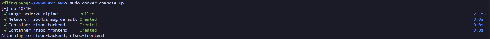
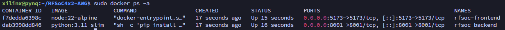

If you want to use Docker to start up both frontend / backend, you need to install these first on the board

Docker installation

sudo apt remove $(dpkg --get-selections docker.io docker-compose docker-compose-v2 docker-doc podman-docker containerd runc | cut -f1)

# Add Docker's official GPG key:

sudo apt update
sudo apt install ca-certificates curl
sudo install -m 0755 -d /etc/apt/keyrings
sudo curl -fsSL https://download.docker.com/linux/ubuntu/gpg -o /etc/apt/keyrings/docker.asc
sudo chmod a+r /etc/apt/keyrings/docker.asc

# Add the repository to Apt sources:

sudo tee /etc/apt/sources.list.d/docker.sources <<EOF
Types: deb
URIs: https://download.docker.com/linux/ubuntu
Suites: $(. /etc/os-release && echo "${UBUNTU_CODENAME:-$VERSION_CODENAME}")
Components: stable
Signed-By: /etc/apt/keyrings/docker.asc
EOF

sudo apt update

sudo apt install docker-ce docker-ce-cli containerd.io docker-buildx-plugin docker-compose-plugin

sudo update-alternatives --config iptables

$ sudo apt-get -y install containerd.io docker-ce docker-ce-cli

disable iptable in daemon.json under /etc/docker/daemon.json

{
"iptables": false
}

Why?

Because petaLinux kernel was not compiled with nftables support, and Docker defaults to using nftables for iptables management. This mismatch causes Docker to fail when it tries to manage iptables rules, leading to errors when starting the Docker service.

After Docker is configured, start the frontend and backend services with Docker Compose:

```bash
sudo docker compose up
```



- After running `docker compose up`, both containers should be running. You can check this with:

```bash
sudo docker ps -a
```



The output also shows which ports are exposed. Depending on your lab setup, use either the IP address of your board or the Tailscale hostname if you decided to use Tailscale. The frontend is available in the browser on port `5173`.

!!! warning
    Docker firewalling can be tricky. Exposed Docker ports can bypass tools such as `ufw`, so do not rely on `ufw` alone for Docker-published services.

    TODO: Add a link for setting up Docker iptables rules or an equivalent firewall configuration.
