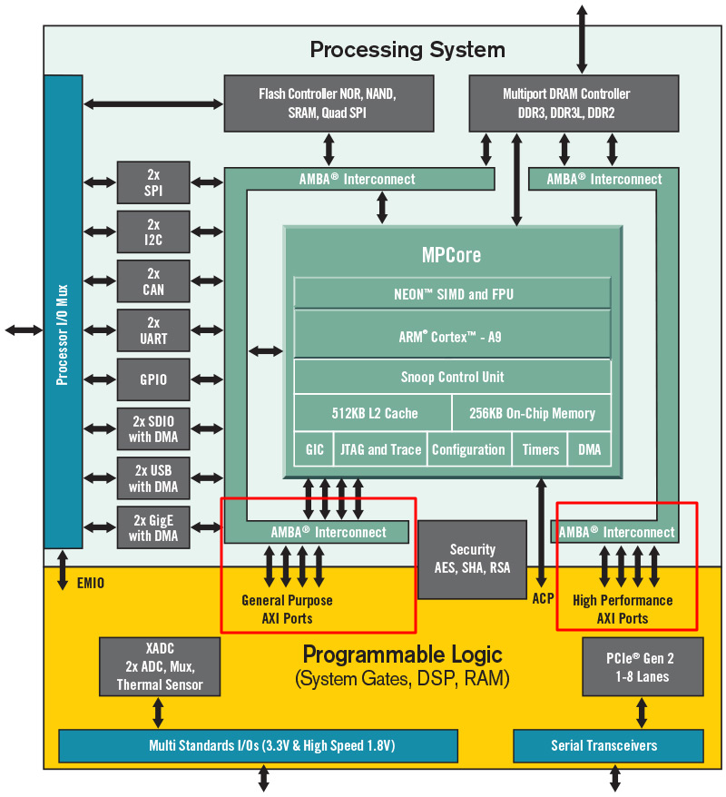

# RFSoC-Based Arbitrary Waveform Generator

This project implements an AWG on the Xilinx RFSoC 4x2 development board. It was developed in the LaserLab Group at Vrije Universiteit Amsterdam to support laser cooling experiments.

## Architecture Overview

We use a hybrid approach where the CPU generates the waveform, while the FPGA outputs the data.



For more information on the board, please refer to [Additional resources](board.md)

## Quick Start

1. [Install the software](installation.md)
2. [Configure networking](networking.md)
3. [Set up remote access](tailscale.md)

## Project Structure

```
RFSoC4x2-AWG/
├── backend/               # FastAPI backend
├── frontend/              # Streamlit based UI
├── firmware/              # Interface to overlay
├── overlay/               # compiled FPGA bitstreams
├── scripts/               # Helper scripts
└── docs/                  # Documentation
```
