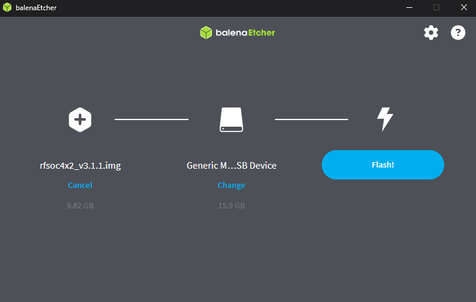

# Installation Guide

This page explains how to get the project running on the RFSoC 4x2 board.


We are not going much into detail on how to get the RFSoC setup, please check out https://www.rfsoc-pynq.io/getting_started.html for that.
All infos:

WIth a brand new SD card, you need to have a SD card writer like balenaEtcher (https://etcher.balena.io/)

download the image from https://www.pynq.io/boards.html for RFSoc 4x2 (latest image)

unpack the downloaded zip file, because you need the .img file,

then use balenaEtcher to write the image to the SD card, then insert the SD card into the board and boot it up. You should see the IP address on the OLED display, then you can connect to it via ssh.



- what you need to set up the RFSoC (SDcard, ethernet cable, etc..)
- how to write your image (download image from https://www.pynq.io/boards.html)
- use someting like balenaEtcher to write your image to an sdcard (https://etcher.balena.io/)
- boot up board and connect for the first time (you often see the IP addres on the oled display)
- if in doubt, use the references, they provided pretty good starting material

## 1) Clone the repository

```bash
git clone https://github.com/selfoluap/RFSoC4x2-AWG.git
cd RFSoC4x2-AWG
```

## 2) Run install script

```bash
install.sh
```

The project uses several services and tools that need board-level setup. Most prerequisites are handled by `scripts/prepare_env.sh`.

Before running it, review the script content to confirm you are comfortable with the environment changes it applies.

> **Note**
> Some hardware-related steps require elevated permissions on the RFSoC board.
