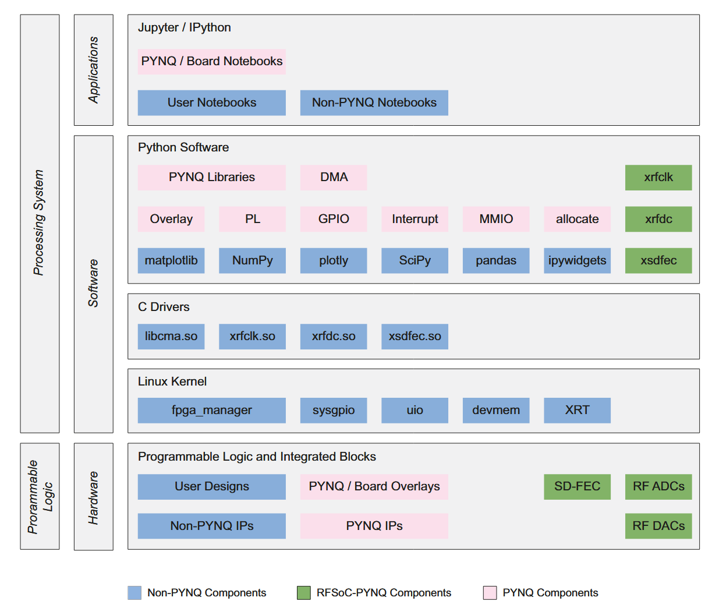

# Jupyter Notebook Environment

The PYNQ environment comes with Jupyter Notebook for more interactive development.



## Accessing Jupyter

Navigate to:

```
http://<rfsoc-awg>:9090
```

Default password: `xilinx`

## Example

Here you should see after installing a couple of example notebooks.
