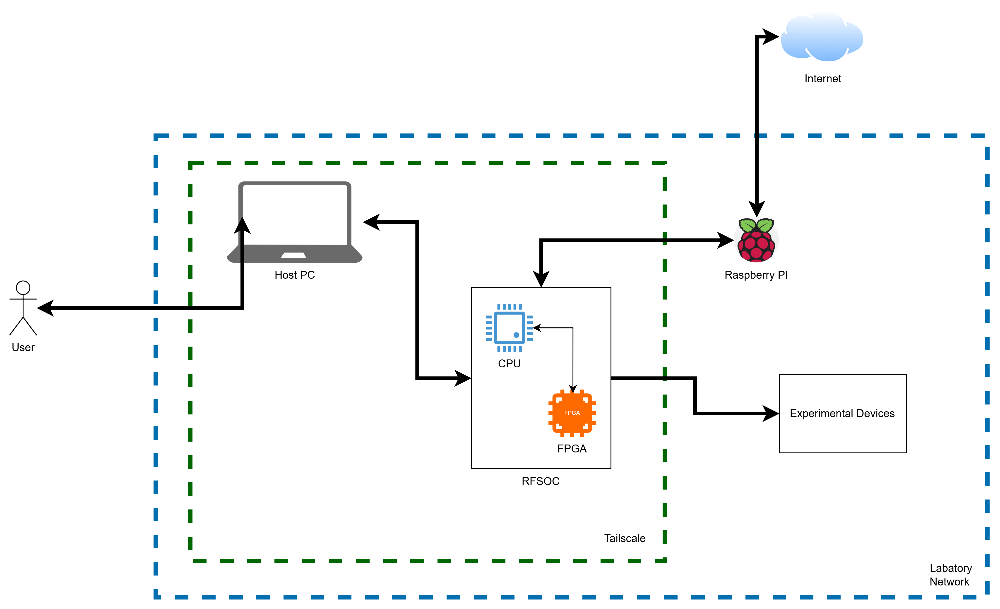

# Networking Architecture

The board can be reached in multiple ways depending on your lab setup or preference.

## Option A: Raspberry Pi bridge



The diagram shows a simplified version of how we set up the network. We make use of tailscale https://tailscale.com/. Tailscale allows to open a secure connection from basically anywhere as long as there is an active internet connection. The RFSoC doesnt come out of the box with any Wifi capabilties, thats why we use a raspberry Raspberry Pi acts as a mobile Wi-Fi receiver and forwards connectivity to the board via Internet briding. If tailscale is then installed on board, we can just use its hostname which should be by default pynq.

```bash
ssh xilinx@<pynq>
```

Refer to [Set up remote access](tailscale.md) for more info on how we used tailscale.

## Option B: Direct Ethernet

If your lab provides wired network access, connect the RFSoC directly by Ethernet and use assigned/static IP. The problem with that approach - if not mistaken - is that internet bridging was not an option when static IPs were assigned.

## Additional material

If you have trouble, this guide provides great material: https://pynq.tue.nl/general/internet/
