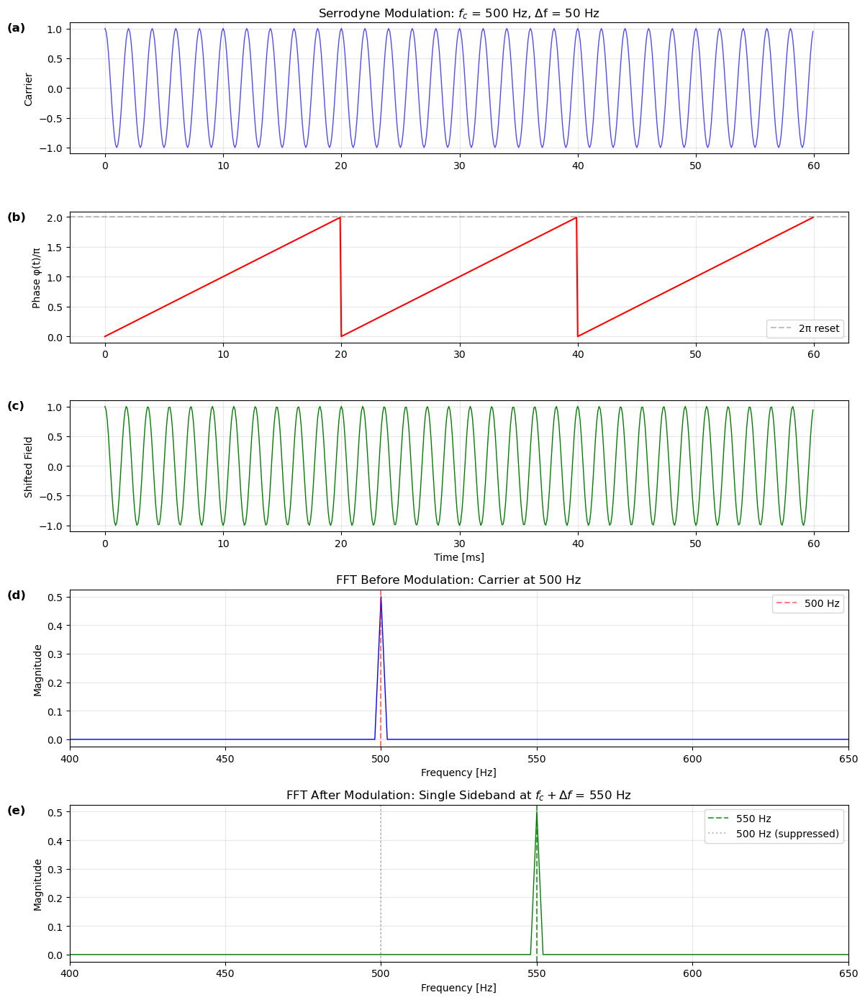

## Usage

This page explains how the board can be used to generate a signal.

# Serrodyne reminder

(a) Unmodulated optical field in the time domain at carrier frequency ( f_0 ).  
(b) Frequency spectrum of the unmodulated field, showing a single spectral line at ( f_0 ).  
(c) Applied phase modulation signal ( \phi(t) ) in the time domain, consisting of a linear phase ramp.  
(d) Resulting phase-modulated optical field in the time domain, exhibiting a constant frequency shift.  
(e) Frequency spectrum of the modulated field, showing a single sideband at ( f_0 + \Delta f ).



The main function for generating serrodyne waveforms is `calculate_serrodyne()` located in `signal_generator.py`:

```python
from backend.signal_generator import calculate_serrodyne

x, y, N = calculate_serrodyne(
    ratios=[1, 5, 3],                      # 3 segments
    freqs_hz=[1330e6, 0, 840e6],        # 3 frequencies
    T_total_s=1e-6,                   # Total duration (65536 samples at 4 GSPS)
    amp=16383.0,                           # Amplitude (14-bit DAC range)
    sr_hz=4.0e9,                           # Sampling rate: 4 GSPS
    continuous_phase=True                  # Maintain phase continuity
)
```

#### Required Parameters

- **`ratios`**: List of integers defining the relative duration of each segment
- **`freqs_hz`**: List of frequencies (in Hz) for each segment
- **`T_total_s`**: Total waveform duration in seconds

#### Keyword Parameters

- **`amp`**: Amplitude of the waveform
- **`sr_hz`**: Sampling rate in Hz
- **`width`**: Sawtooth width parameter
- **`continuous_phase`**: Phase continuity between segments

### Example 1: Simple Single-Frequency Serrodyne

```python
# Generate 100 MHz serrodyne waveform
x, y, N = calculate_serrodyne(
    ratios=[1],
    freqs_hz=[100e6],
    T_total_s=16.384e-6,
    amp=16383.0,
    sr_hz=4.0e9,
    continuous_phase=True
)
```

### Example 2: Multi-Segment Waveform

```python
# Create a complex waveform with three segments
# Segment 1: 1330 MHz (1 unit duration)
# Segment 2: DC hold (5 units duration)
# Segment 3: 840 MHz (3 units duration)
x, y, N = calculate_serrodyne(
    ratios=[1, 5, 3],
    freqs_hz=[1330e6, 0, 840e6],
    T_total_s=16.384e-6,
    amp=16383.0,
    sr_hz=4.0e9,
    continuous_phase=True
)
```

#### Example 3: Frequency Sweep

```python
# Create a stepped frequency sweep
sweep_freqs = [100e6, 200e6, 300e6, 400e6, 500e6]
equal_ratios = [1] * len(sweep_freqs)

x, y, N = calculate_serrodyne(
    ratios=equal_ratios,
    freqs_hz=sweep_freqs,
    T_total_s=16.384e-6,
    amp=16383.0,
    sr_hz=4.0e9,
    continuous_phase=True
)
```

### Using the React Interface

The React frontend provides controls for generating and outputting serrodyne waveforms through the FastAPI backend. See the [UI page](ui.md) for the current interface.

### Using the REST API

For programmatic control, use the FastAPI backend:

```python
import requests

# Generate and output serrodyne waveform
response = requests.post(
    "http://rfsoc-awg:8001/generate/serrodyne",
    json={
        "ratios_str": "1:5:3",
        "freqs_str": "1330, 0, 840",  # MHz
        "T_total_us": 16.384,
        "amp": 16383,
        "precorrection": False
    }
)

data = response.json()
print(f"Generated {data['N']} samples")
print(f"Peak frequency: {data['peak_freq_mhz']} MHz")
```

## Technical Specifications

### Hardware Constraints

- **DAC Resolution**: 14-bit (±16383 range)
- **DAC Sampling Rate**: 4.0 GSPS (8.0 GSPS supported but not fully tested)
- **ADC Sampling Rate**: 4.0 GSPS
- **Buffer Length**: 65,536 samples (16.384 μs at 4 GSPS)
- **Maximum Frequency**: Nyquist limit = 2 GHz (at 4 GSPS)

### Timing Considerations

The buffer length determines the waveform duration:

```
Duration = N_samples / Sampling_Rate
16.384 μs = 65536 / 4.0e9
```

For continuous operation, the waveform loops automatically when output to the DAC.

### Frequency Resolution

Frequency resolution depends on the waveform duration and segment ratios:

```
Δf = 1 / T_segment
```

For a single-segment waveform with `T_total = 16.384 μs`:

```
Δf = 1 / 16.384e-6 ≈ 61.04 kHz
```
