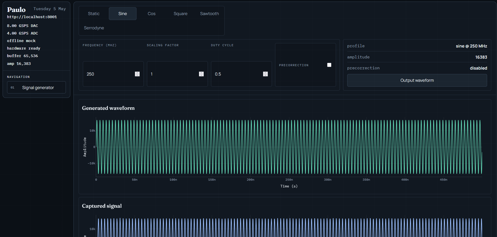

# User Interface

The current user interface is a simple React app. It provides basic controls for generating and outputting waveforms through the FastAPI backend.



Current functionality is limited to a small set of signal types:

- cosine
- sine
- square
- sawtooth
- serrodyne

The frontend is served on port `5173` when started through Docker Compose. Depending on your lab setup, open it with either the board IP address or the Tailscale hostname:

```text
http://<board-ip>:5173
http://rfsoc-awg:5173
```

The React app sends waveform requests to the FastAPI backend, which is exposed separately by Docker Compose.
